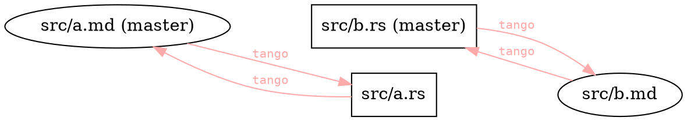
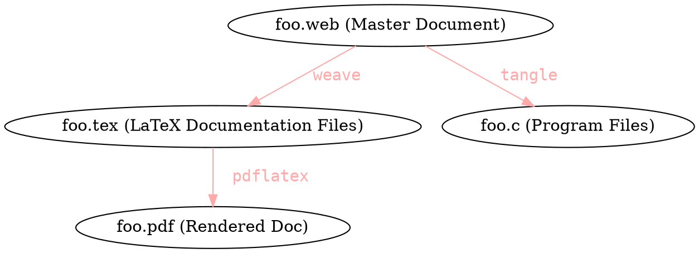
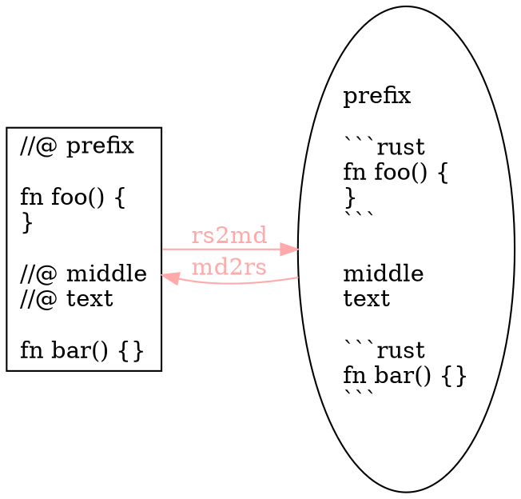
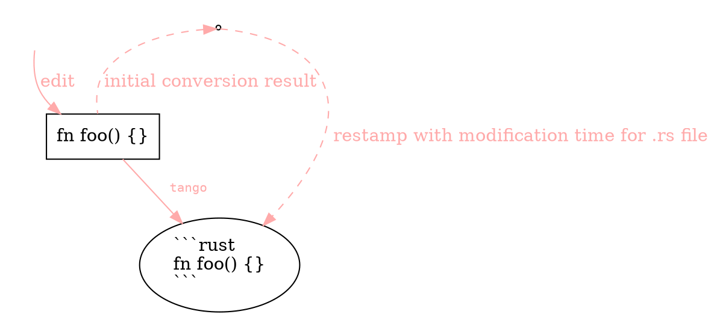
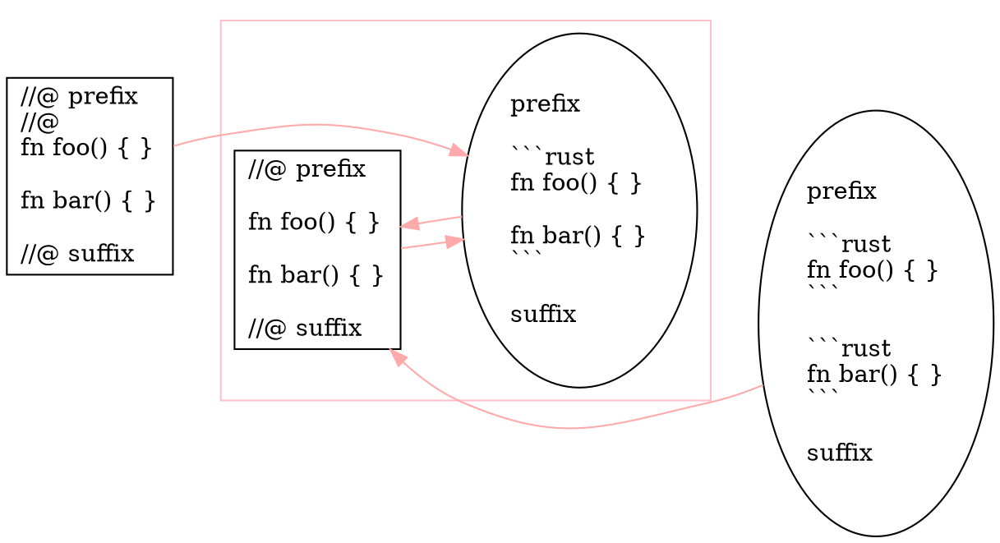

% `tango`: dancing around literate programming
% Felix Klock (`@pnkfelix`), Mozilla
% date: 16 June 2016

## `tango`: dancing around literate programming  { data-transition="fade" }



# What is `tango`? {.center data-transition="fade"}

## Goal of `tango`: { data-transition="fade"}

### Simple literate programming for Rust

. . .

* I have been using for tutorial presentations

* [http://bit.ly/1LQM3PS](http://bit.ly/1LQM3PS)

* [http://is.gd/3oAeuH](http://is.gd/3oAeuH)

(meta: written with `tango`; see [`http://bit.ly/2618VSS`])

## Quick Apologies { data-transition="fade-in"}

>- (Lightning) talk about tool for presenting Rust ...
>- ... but talk presents zero real Rust snippets. Sorry.
>- Implementation = Ugly hacks (some described later) ...
>- ... maybe one day I will revise to use better idioms. Sorry.
>- Cool visuals due to `reveal.js` + `pandoc` (*not* `tango`)
>- Using `pandoc` crate; "just" shells out to `pandoc`. Sorry.

(meta: written with `tango`; see [`http://bit.ly/2618VSS`])

[`http://bit.ly/2618VSS`]: https://github.com/pnkfelix/tango-demo/blob/tango-presentation/src/slides.md

# Concrete Demo {.center}

## { data-transition="fade-out" }

### Presenter writes:

    ```rust
    pub fn main() { println!("Hello post `tango`"); }
    ```

    * What is Literate Programming (LP)?

    * What is `tango`'s approach to LP?


### Computer runs:

```
% cargo run
   Compiling tango-demo v0.1.0 (file:///Users/fklock/Dev/Rust/tango-demo)
     Running `target/debug/main`
Hello post `tango`
```

(`cargo` build script pushes `tango` onto dance floor.)

## { data-transition="fade" }

### Presenter writes:

    ```rust
    pub fn main() { println!("Hello post `tango`"); }
    ```

    * What is Literate Programming (LP)?

    * What is `tango`'s approach to LP?


### IDE sees (Rust source):

``` {.rust}
pub fn main() { println!("Hello post `tango`"); }

//@ * What is Literate Programming (LP)?
//@
//@ * What is `tango`'s approach to LP?
```

## { data-transition="fade" }

### Presenter writes:

    ```rust
    pub fn main() { println!("Hello post `tango`"); }
    ```

    * What is Literate Programming (LP)?

    * What is `tango`'s approach to LP?

### Audience sees:

```rust
pub fn main() { println!("Hello post `tango`"); }
```

* What is Literate Programming (LP)?

* What is `tango`'s approach to LP?

# Literate Programming (LP)  { .center }

## Knuth's Literate Programming: WEB

> Instead of imagining that our main task is to instruct a **computer** what to do,
> let us concentrate rather on explaining to **human beings** what we want a computer to do.
>
> -- Donald Knuth, 1983

[http://www.literateprogramming.com/knuthweb.pdf](http://www.literateprogramming.com/knuthweb.pdf)

(Examples include TeX, Metafont, SGB.)

## Usual LP approach



Programmer edits `.web`; utils create intermediate source

. . .

(WEB `tangle` output "write-only"; IMO `weave` is too)

Architecture motivated (in part) by language limitations

# Tango's approach (`tango` is not `WEB`!) { .center }

## "Source": matter of perspective  { data-transition="fade" }


Edit either; `tango` regenerates the other

. . .

One *should* `cargo build` before switch between `.rs`/`.md`

But: editing both first will *not* destroy work!

# Trick(s) to `tango`'ing  { .center }

## implementation

* line-oriented state machines (+ `timestamp` module)

* `rs2md`: rust content encoded as &#96;&#96;&#96;`rust` code blocks

* `md2rs`: markdown encoded as `//@` prefixed comments



## timestamp games { data-transition="fade-out" }

`tango` runs in response to `cargo build`

And `tango` updates/creates source files

. . .

* Problem: If done naively, such runs would cause
  subsequent `cargo build` to reprocess and rebuild (every time).

. . .

Goal: no unnecessary `cargo` rebuilds

## timestamp games { data-transition="fade-in" }

The trick



##

### bijective submapping



(double `tango` is idempotent)

. . .

e.g. some "no-op transitions" \[re\]moved at whim of `tango`.

## Other hacks {.center}

Encoding attributes attached to code blocks (`//@@ `)

e.g. `//@@ { .attribute1 .attribute2 }`

Playpen link integration (`//@@@ `)

e.g. `//@@@ playpen link name`

# Adds up to... {.center}

## {.center}

``` {.rust}
//@ You can follow [stripey] to the *playpen*!

//@@ { .stripes }
#[test]
pub fn blinking_code() {
    println!("This code does not actually blink");
}
//@@@ stripey
```

### will `tango` into:

You can follow [stripey] to the *playpen*!

```{.rust .stripes}
#[test]
pub fn blinking_code() {
    println!("This code does not actually blink");
}
```
[stripey]: https://play.rust-lang.org/?code=%23%5Btest%5D%0Apub%20fn%20blinking_code%28%29%20%7B%0A%20%20%20%20println%21%28%22This%20code%20does%20not%20actually%20blink%22%29%3B%0A%7D&version=nightly

(assuming appropriate CSS definition for `.stripes`)

. . .

Above: our moment of zen. **Thanks!!!**
