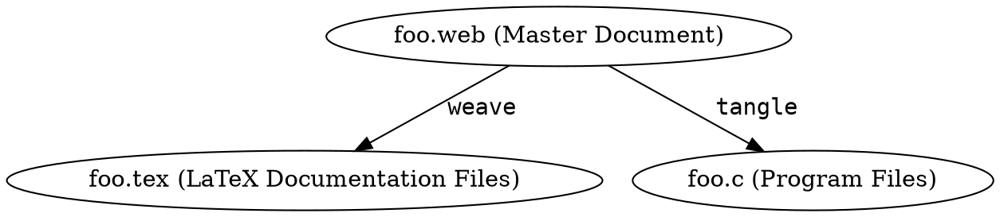
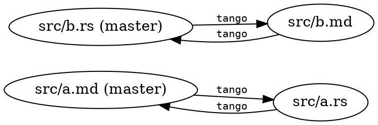
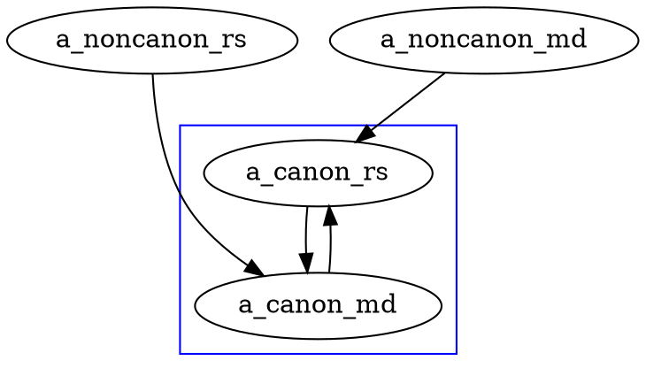
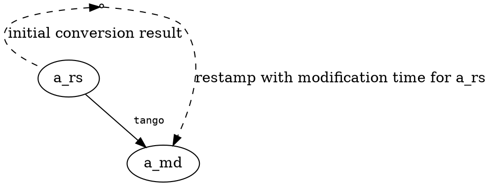

# `tango`: dancing around literate programming {.center}

## Goal of `tango`: Workflow { .center }

## { data-transition="fade" }

### Presenter writes:

    ```rust
    pub fn main() { println!("Hello post `tango`"); }
    ```

    * What is Literate Programming (LP)?

    * What is `tango`'s approach to LP?


### Computer runs:

```
% cargo run
   Compiling tango-demo v0.1.0 (file:///Users/fklock/Dev/Rust/tango-demo)
     Running `target/debug/main`
Hello post `tango`
```

. . .

(`cargo` build script pushes `tango` onto dance floor.)

## { data-transition="fade" }

### Presenter writes:

    ```rust
    pub fn main() { println!("Hello post `tango`"); }
    ```

    * What is Literate Programming (LP)?

    * What is `tango`'s approach to LP?


### IDE (i.e. Rust source) sees:

``` {.rust}
pub fn main() { println!("Hello post `tango`"); }

//@ * What is Literate Programming (LP)?
//@
//@ * What is `tango`'s approach to LP?
```

## { data-transition="fade" }

### Presenter writes:

    ```rust
    pub fn main() { println!("Hello post `tango`"); }
    ```

    * What is Literate Programming (LP)?

    * What is `tango`'s approach to LP?

### Audience sees:

```rust
pub fn main() { println!("Hello post `tango`"); }
```

* What is Literate Programming (LP)?

* What is `tango`'s approach to LP?


# Literate Programming (LP)  { .center }

## Knuth on Literate Programming

Program source is meant to be read by humans

TODO

## Usual LP approach



Programmer edits the `.web`, then runs programs to generate either
the doc source or the program source

. . .

(The `tangle` output is notably illegible; the `weave` output is
better. But both outputs are intermediate representations, not
products fit for human consumption.)

# Tango's approach to LP { .center }

## "Source": matter of perspective  { data-transition="fade" }



Edit either; `tango` regenerates the other

. . .

*Should* run `cargo build` before switching twixt `.rs` & `.md`.

But: editing both without `cargo build` will *not* destroy work.

# The Trick(s) to `tango`'ing  { .center }

## `tango` trick: bijective submapping



(double `tango` is idempotent)


## `tango` trick: timestamp games { data-transition="fade-out" }

`tango` runs in response to `cargo build`

And `tango` updates/creates source files

Goal: no unnecessary `cargo` rebuilds

## `tango` trick: timestamp games { data-transition="fade-in" }

The trick



## `tango` implementation

line-oriented state machine
