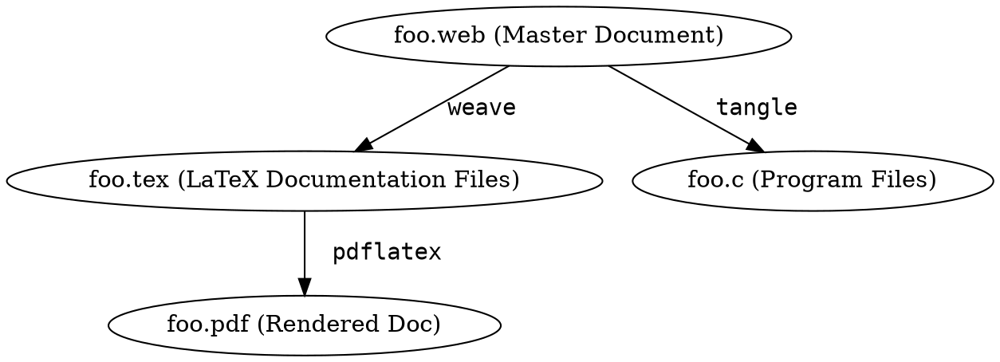
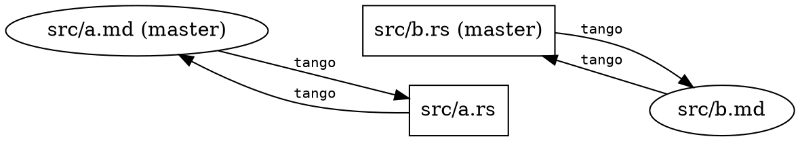
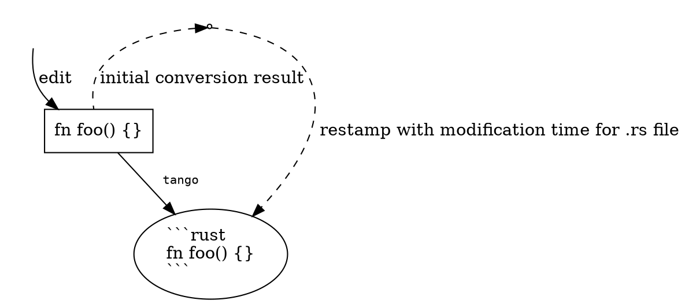
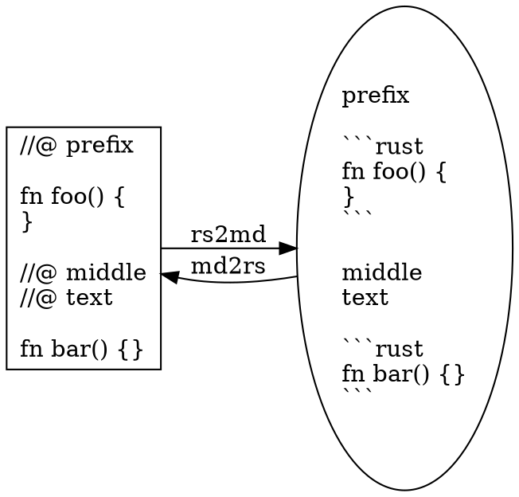
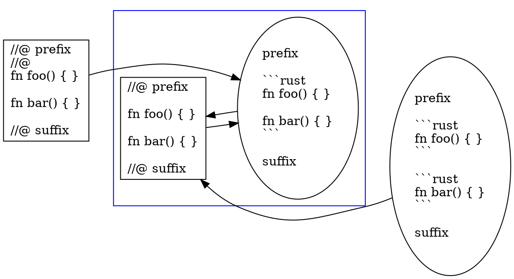

# `tango`: dancing around literate programming {.center}

## Goal of `tango`: { .center }

### Simple literate programming for Rust

## { data-transition="fade" }

### Presenter writes:

    ```rust
    pub fn main() { println!("Hello post `tango`"); }
    ```

    * What is Literate Programming (LP)?

    * What is `tango`'s approach to LP?


### Computer runs:

```
% cargo run
   Compiling tango-demo v0.1.0 (file:///Users/fklock/Dev/Rust/tango-demo)
     Running `target/debug/main`
Hello post `tango`
```

(`cargo` build script pushes `tango` onto dance floor.)

## { data-transition="fade" }

### Presenter writes:

    ```rust
    pub fn main() { println!("Hello post `tango`"); }
    ```

    * What is Literate Programming (LP)?

    * What is `tango`'s approach to LP?


### IDE (i.e. Rust source) sees:

``` {.rust}
pub fn main() { println!("Hello post `tango`"); }

//@ * What is Literate Programming (LP)?
//@
//@ * What is `tango`'s approach to LP?
```

## { data-transition="fade" }

### Presenter writes:

    ```rust
    pub fn main() { println!("Hello post `tango`"); }
    ```

    * What is Literate Programming (LP)?

    * What is `tango`'s approach to LP?

### Audience sees:

```rust
pub fn main() { println!("Hello post `tango`"); }
```

* What is Literate Programming (LP)?

* What is `tango`'s approach to LP?

. . .

(above is the actual outline for the talk.)

# Literate Programming (LP)  { .center }

## Knuth on Literate Programming

> Instead of imagining that our
> main task is to instruct a
> **computer**
> what to do, let us
> concentrate rather on explaining to
> **human beings**
> what
> we want a computer to do.
>
> -- Donald Knuth, 1983

[`http://www.literateprogramming.com/knuthweb.pdf`](http://www.literateprogramming.com/knuthweb.pdf)

## Usual LP approach



> Programmer edits `.web`; programs generate intermediate source

. . .

(Output `tangle` is "write-only"; IMO `weave` is not much better.)

[`http://www.literateprogramming.com/knuthweb.pdf`](http://www.literateprogramming.com/knuthweb.pdf)

# Tango's approach to LP { .center }

## "Source": matter of perspective  { data-transition="fade" }



Edit either; `tango` regenerates the other

. . .

*Should* run `cargo build` before switching twixt `.rs` & `.md`.

But: editing both without `cargo build` will *not* destroy work.

# Trick(s) to `tango`'ing  { .center }

## trick: timestamp games { data-transition="fade-out" }

`tango` runs in response to `cargo build`

And `tango` updates/creates source files

. . .

> Problem: If above done naively, the newly created source will cause
> subsequent `cargo build` to reprocess and rebuild every time.

. . .

Goal: no unnecessary `cargo` rebuilds

## trick: timestamp games { data-transition="fade-in" }

The trick



## `tango` implementation

* pair of line-oriented state machines (and `timestamp` utility module)

* `rs2md`: markdown content encoded as `//@` prefixed comments

* `md2rs`: rust content encoded as &#96;&#96;&#96;`rust` code blocks



## trick: bijective submapping



(double `tango` is idempotent)

. . .

e.g. certain "no-op transitions" moved or eliminated at whim of `tango`.

## Other hacks {.center}

* encoding attributes attached to code blocks

* playpen link integration

# Adds up to... {.center}

## {.center}

### This .rs source:

``` {.rust}
//@ You can has [stripey playpen][stripey] links!

//@@ { .stripes}
#[test]
pub fn blinking_code() {
    println!("This code does not actually blink");
}
//@@@ stripey
```

### will `tango` into:

You can has [stripey playpen][stripey] links!

```{.rust .stripes}
#[test]
pub fn blinking_code() {
    println!("This code does not actually blink");
}
```
[stripey]: https://play.rust-lang.org/?code=%23%5Btest%5D%0Apub%20fn%20blinking_code%28%29%20%7B%0A%20%20%20%20println%21%28%22This%20code%20does%20not%20actually%20blink%22%29%3B%0A%7D&version=nightly

(assuming appropriate CSS definition for `.stripes`)

. . .

**Thanks!!!**
