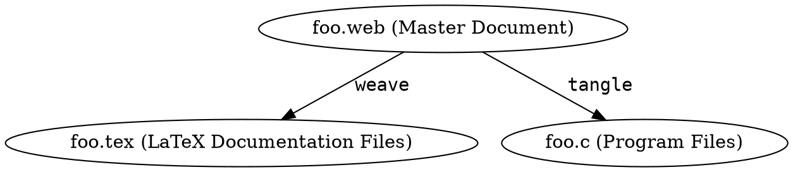
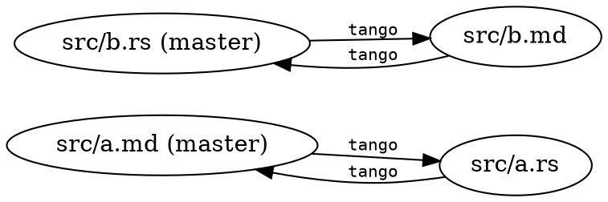

# Why Learn To `tango`? {.center}

## Goal of `tango`: Workflow { .center }

## { data-transition="fade-out" }

### Presenter writes:

    ```rust
    pub fn main() { println!("Hello from `tango`"); }
    ```

    * What is Literate Programming (LP)?

    * What is `tango`'s approach to LP?

### Audience sees:

```rust
pub fn main() { println!("Hello from `tango`"); }
```

* What is Literate Programming (LP)?

* What is `tango`'s approach to LP?

## { data-transition="fade" }

### Presenter writes:

    ```rust
    pub fn main() { println!("Hello from `tango`"); }
    ```

    * What is Literate Programming (LP)?

    * What is `tango`'s approach to LP?


### IDE sees:

``` {.rust}
pub fn main() { println!("Hello from `tango`"); }

//@ * What is Literate Programming (LP)?
//@
//@ * What is `tango`'s approach to LP?
```

## { data-transition="fade" }

### Presenter writes:

    ```rust
    pub fn main() { println!("Hello from `tango`"); }
    ```

    * What is Literate Programming (LP)?

    * What is `tango`'s approach to LP?


### Computer runs:

```
% cargo run
   Compiling tango-demo v0.1.0 (file:///Users/fklock/Dev/Rust/tango-demo)
     Running `target/debug/main`
Hello from `tango`
```

##

# Outline

* What is Literate Programming (LP)?

* What is `tango`'s approach to LP?

# Literate Programming (LP)

## Knuth on Literate Programming

Program source is meant to be read by humans

TODO

## Usual LP approach



Programmer edits the `.web`, then runs programs to generate either
the doc source or the program source

. . .

(The `tangle` output is notably illegible; the `weave` output is
better. But both outputs are intermediate representations, not
products fit for human consumption.)

# Tango's approach to LP

## Source is a matter of perspective



You edit whichever document you like, and running `tango` regenerates
the other from it.

 . . .

You *should* run `cargo build` before switching twixt `.rs` & `.md`.

But, editing both `foo.rs` and `foo.md` will *not* destroy your
work. `tango` will refuse to overwrite either file; you will need to
pick one and propagate other changes over.

# The Trick(s) to `tango`'ing

## `tango` trick: bijective submapping

## `tango` trick: double tango is idempotent

## `tango` trick: timestamp games
